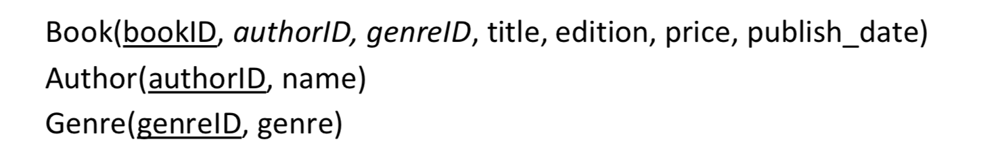
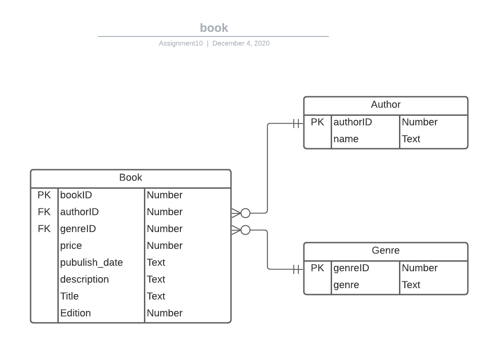

### [Task 1] Create the schema and ERD
## [1-A] BCNF Schema
Showing in the picture.
Underline stands for primary key.
Italic stands for foreign key.


## [1-B] ERD
This is a normalized ERD model and not a direct representation of the data in the files. 



### [Task 2] Create a sqlite database
## Preparation of R Environment
* Connect to local database while creating a datbase named as __"books.db"__.
* set working directory locally for R session.
```{r}
# set working diretory
setwd("~/Documents/course/cs5200/assignment10")

# connect to SQLite local database
require(DBI)
db <- dbConnect(RSQLite::SQLite(),"books.db")
```

## Create all data tables
```{r}
# 1. create table Book
dbExecute(db, 
          "CREATE TABLE Book (
            bookID Text PRIMARY KEY NOT NULL,
            authorID INTEGER, 
            genreID INTEGER, 
            title Text,
            edition Text,
            price real, 
            publish_date TEXT, 
            description Text, 
            FOREIGN KEY(authorID) REFERENCES Author(authorID)
            FOREIGN KEY(genreID) REFERENCES Genre(genreID)
            );" 
          )

# 2. create table Author
dbExecute(db, 
          "CREATE TABLE Author (
              authorID INTEGER PRIMARY KEY NOT NULL, 
              name TEXT 
            );"
          )

# 3. create table Genre
dbExecute(db, 
          "CREATE TABLE Genre (
              genreID INTEGER PRIMARY KEY NOT NULL,
              genre TEXT
            );"
          )

```

### [Task 3] Load XML data into dataframe node by node
```{r}

library (XML)

# Reading the XML file and parse into DOM
xmlDOM <- xmlParse(file = "Books-v3.xml")

# get the root node of the DOM tree
r <- xmlRoot(xmlDOM)

# get number of children of root (number of purchase orders)
numBook <- xmlSize(r)

# create various data frames to hold data; initial values are just
# to define data type and length and will be replaced
Book.df <- data.frame (bookID = 1:numBook,
                       authorID = vector (mode = "character", 
                                         length = numBook),
                       genreID = vector (mode = "character", 
                                            length = numBook),
                       title = vector (mode = "character", 
                                         length = numBook),
                       edition = vector (mode = "character", 
                                         length = numBook),
                       price = vector (mode = "numeric", 
                                        length = numBook),
                       publish_date = vector (mode = "character", 
                                        length = numBook),
                       description = vector (mode = "character", 
                                        length = numBook),
                     stringsAsFactors = F)


Author.df <- data.frame (authorID = 1:numBook,
                        name = vector (mode = "character", length = numBook), 
                        stringsAsFactors = F)

Genre.df <- data.frame (genreID = 1:numBook,
                        genre = vector (mode = "character", length = numBook), 
                        stringsAsFactors = F)

Author.Counter <- 1
Genre.Counter <- 1

for (i in 1:numBook)
{
  # get next book node
  book <- r[[i]]
  
  # get the bookID and make PK (attributes)
  bID <- xmlAttrs(book)
  
  Book.df$bookID[i] <- bID
  
  rowNum <- 1
  # process author
  aName <- xmlValue(book[[rowNum]])
  # update Author dataframe
  if(aName %in% Author.df$name){
    aid <- which(Author.df$name == aName)
  }else{
    aid <- Author.Counter
    Author.df$authorID[Author.Counter] <- aid
    Author.df$name[Author.Counter] <- aName
    Author.Counter <- Author.Counter + 1
  }
  Book.df$authorID[i] <- aid
  # deal with single quote for next insert step
  rowNum <- rowNum + 1
    
  # process title
  title <- xmlValue(book[[rowNum]])
  Book.df$title[i] <- title
  rowNum <- rowNum + 1
  
  # <Edition> is optional, so skip if not present
  element <- book[[rowNum]]
  if (xmlName(element) == "edition")
  {
    edition <- xmlValue(book[[rowNum]])
    Book.df$edition[i] <- edition
    rowNum <- rowNum + 1
  }
  
  # process genre
  genre <- xmlValue(book[[rowNum]])
  # update Genre dataframe
  if(genre %in% Genre.df$genre){
    gid <- which(Genre.df$genre == genre)
  }else{
    gid <- Genre.Counter
    Genre.df$genreID[Genre.Counter] <- gid
    Genre.df$genre[Genre.Counter] <- genre
    Genre.Counter <- Genre.Counter + 1
  }
  Book.df$genreID[i] <- gid
  rowNum <- rowNum + 1
  
  # process price
  price <- as.numeric(xmlValue(book[[rowNum]])) 
  Book.df$price[i] <- price
  rowNum <- rowNum + 1
  
  # process publish_date
  publish_date <- xmlValue(book[[rowNum]])
  Book.df$publish_date[i] <- publish_date
  rowNum <- rowNum + 1
  
  # process description
  description <- xmlValue(book[[rowNum]])
  Book.df$description[i] <- description
  rowNum <- rowNum + 1
}

Book.df
Author.df
Genre.df
```


### [Task 4] Write dataframe to appropriate tables in the database.
##1. Table: Author
```{R}
# Write dataframe to a temp table
dbWriteTable(db, name = "authorTemp", value = Author.df, row.names = FALSE)

# insert data into Author table
dbSendQuery(db, 
            "INSERT INTO Author(authorID, name) 
            SELECT authorID, name
            FROM authorTemp
            WHERE authorTemp.name!='' AND authorTemp.name IS NOT NULL;")

# check if data is inserted successfully
dbGetQuery(db, "SELECT * FROM Author;")
```


##2. Table: Genre
```{R}
# Write dataframe to a temp table
dbWriteTable(db, name = "genreTemp", value = Genre.df, row.names = FALSE)

# insert data into Genre table
dbSendQuery(db, 
            "INSERT INTO Genre(genreID, genre) 
            SELECT genreID, genre
            FROM genreTemp
            WHERE genreTemp.genre!='' AND genreTemp.genre IS NOT NULL;")

# check if data is inserted successfully
dbGetQuery(db, "SELECT * FROM Genre;")
```
##3. Table: Book
```{R}
# Write dataframe to a temp table
dbWriteTable(db, name = "bookTemp", value = Book.df, row.names = FALSE)

# insert data into table 
dbSendQuery(db, 
"INSERT INTO Book(bookID, authorID, genreID, title, edition, price, publish_date, description) 
SELECT bookID, authorID, genreID, title, edition, price, publish_date, description FROM bookTemp;")

# check if data is inserted successfully
dbGetQuery(db, "SELECT * FROM Book;")
```
### [Task 5] Build SQL chunks for the following queries.
##[A]List the titles and the prices of all books written by "Galos, Mike".
```{r}
dbGetQuery(db, "SELECT title, price
FROM Book
Join Author on Book.authorID = Author.authorID
WHERE Author.name = 'Galos, Mike';")
```
##[B]The most recent year of publication of all books written by "O'Brien, Tim"
```{r}
dbGetQuery(db, 'SELECT max(ExtractString) as recent_year
                FROM(
                SELECT SUBSTR(publish_date, 1, 4) AS ExtractString
                FROM Book
                Join Author on Book.authorID = Author.authorID
                WHERE Author.name = "O\'Brien, Tim"
                );')
```
##[C]The average price of all books in the "Fantasy" genre.
```{r}
dbGetQuery(db, 'SELECT AVG(price) as avg
                FROM Book
                Join Genre on Book.genreID = Genre.genreID
                WHERE Genre.genre = "Fantasy";')
```
##[D]The number of books in each genre.
```{r}
dbGetQuery(db, 'SELECT genre, Count(Genre.genre) as number
                FROM Book
                Join Genre on Book.genreID = Genre.genreID
                Group by Genre.genre;')
```
##[E]The title and author of all books that cost less than the average price of books.
```{r}
dbGetQuery(db, 'SELECT Title, name as author
                FROM Book
                Join Author on Book.authorID = Author.authorID
                Where price < (
                Select AVG(price)
                From Book
                );')
```


